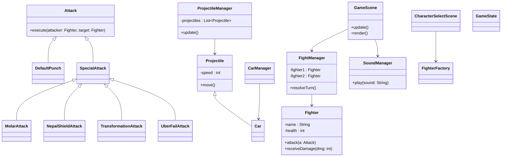
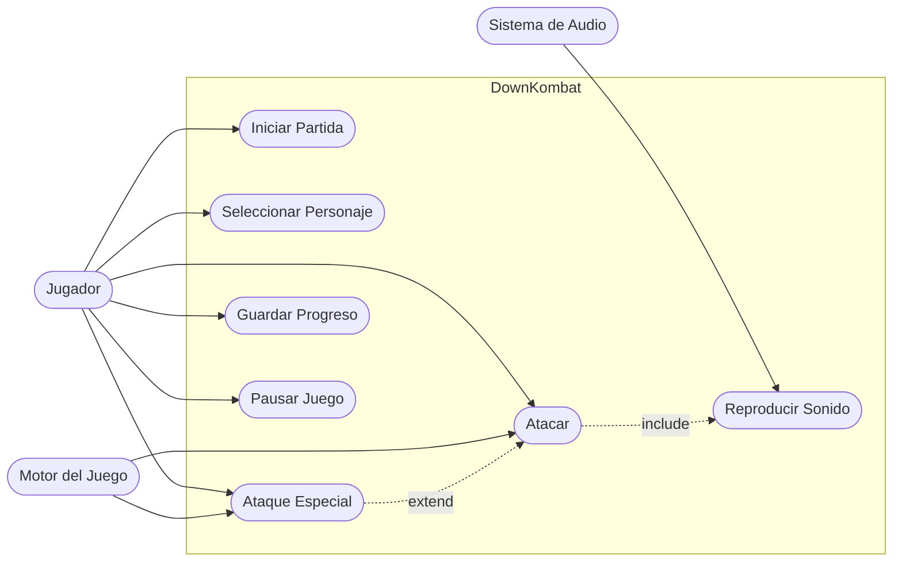
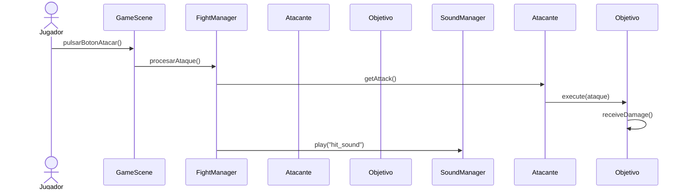

# down-kombat
DOWN KOMBAT es un videojuego de lucha 2D en tiempo real desarrollado en Java + JavaFX como proyecto final de DAW, aplicando modelado UML, control de versiones con GitFlow y análisis de calidad del código.
diagrama de clases

Diagrama de Casos de Uso

DIAGRAMA DE SECUENCIA

